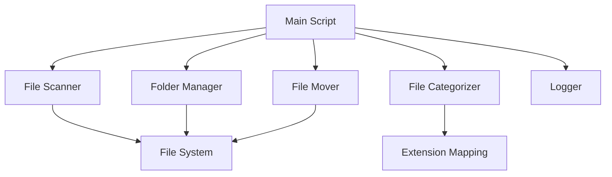

# Design Document: Desktop File Organizer

## Overview

The Desktop File Organizer is a command-line Python application that automatically organizes files on a Windows Desktop by categorizing them based on file extensions. The system follows a simple pipeline: scan → categorize → create folders → move files. The design emphasizes simplicity, robustness, and clear separation of concerns between file system operations, categorization logic, and user feedback.

## Architecture

The system follows a modular architecture with three main layers:

1. **File System Layer**: Handles all interactions with the file system (scanning, creating directories, moving files)
2. **Categorization Layer**: Maps file extensions to category names
3. **Orchestration Layer**: Coordinates the overall organization process and provides user feedback



## Components and Interfaces

### 1. FileScanner

**Responsibility**: Enumerate files in the Desktop directory

**Interface**:
```python
class FileScanner:
    def __init__(self, desktop_path: str):
        """Initialize scanner with Desktop path"""
        
    def scan_files(self) -> List[Path]:
        """
        Scan Desktop directory and return list of file paths.
        Excludes subdirectories, returns only files.
        """
```

### 2. FileCategorizer

**Responsibility**: Map file extensions to category names

**Interface**:
```python
class FileCategorizer:
    CATEGORIES = {
        'Images': ['.jpg', '.jpeg', '.png', '.gif', '.bmp', '.svg', '.ico'],
        'Documents': ['.pdf', '.doc', '.docx', '.txt', '.xlsx', '.pptx', '.odt'],
        'Videos': ['.mp4', '.avi', '.mkv', '.mov', '.wmv', '.flv'],
        'Music': ['.mp3', '.wav', '.flac', '.aac', '.ogg', '.wma'],
        'Archives': ['.zip', '.rar', '.7z', '.tar', '.gz'],
        'Code': ['.py', '.js', '.html', '.css', '.java', '.cpp', '.c', '.ts', '.json'],
    }
    
    def categorize_file(self, file_path: Path) -> str:
        """
        Return category name for a file based on its extension.
        Returns 'Miscellaneous' for unrecognized or missing extensions.
        """
```

### 3. FolderManager

**Responsibility**: Create category folders as needed

**Interface**:
```python
class FolderManager:
    def __init__(self, base_path: str):
        """Initialize with base Desktop path"""
        
    def create_category_folder(self, category_name: str) -> Path:
        """
        Create category folder if it doesn't exist.
        Returns path to the category folder.
        Handles existing folders gracefully.
        """
```

### 4. FileMover

**Responsibility**: Move files to category folders with conflict resolution

**Interface**:
```python
class FileMover:
    def move_file(self, source: Path, destination_folder: Path) -> bool:
        """
        Move file from source to destination folder.
        Handles name conflicts by appending numbers (e.g., file_1.txt).
        Returns True if successful, False otherwise.
        Preserves file extension and content.
        """
        
    def _resolve_name_conflict(self, destination: Path) -> Path:
        """
        Generate unique filename if destination already exists.
        Appends _1, _2, etc. before the extension.
        """
```

### 5. OrganizationLogger

**Responsibility**: Provide user feedback and progress tracking

**Interface**:
```python
class OrganizationLogger:
    def log_start(self):
        """Log organization process start"""
        
    def log_file_move(self, filename: str, category: str):
        """Log individual file movement"""
        
    def log_error(self, filename: str, error: str):
        """Log error for a specific file"""
        
    def log_summary(self, stats: Dict[str, int], duration: float):
        """Log final summary with category counts and execution time"""
```

### 6. DesktopOrganizer (Main Orchestrator)

**Responsibility**: Coordinate the entire organization process

**Interface**:
```python
class DesktopOrganizer:
    def __init__(self, desktop_path: Optional[str] = None):
        """
        Initialize organizer with Desktop path.
        If None, automatically detect Windows Desktop path.
        """
        
    def organize(self) -> Dict[str, int]:
        """
        Execute the full organization process:
        1. Scan files
        2. Categorize each file
        3. Create necessary folders
        4. Move files to categories
        5. Return statistics
        """
```

## Data Models

### File Information
```python
@dataclass
class FileInfo:
    path: Path
    name: str
    extension: str
    category: str
```

### Organization Statistics
```python
@dataclass
class OrganizationStats:
    total_files: int
    files_moved: int
    files_failed: int
    category_counts: Dict[str, int]
    duration: float
```

## Error Handling

The system implements graceful error handling at multiple levels:

1. **Permission Errors**: Caught during file move operations, logged, and processing continues
2. **File In Use Errors**: Caught during file move operations, logged, and processing continues
3. **Desktop Access Errors**: Caught at initialization, terminates with clear error message
4. **Unexpected Errors**: Caught with generic exception handler, logged with details, processing continues

Error handling strategy:
- Use try-except blocks around file system operations
- Log all errors with context (filename, operation, error message)
- Continue processing remaining files after individual failures
- Only terminate on critical errors (e.g., Desktop directory inaccessible)

## Testing Strategy

### Unit Testing

We'll use **pytest** as the testing framework for unit tests.

Unit tests will cover:
- Extension mapping for each category
- Name conflict resolution logic (file_1.txt, file_2.txt pattern)
- Desktop path detection on Windows
- Error message formatting
- Statistics calculation

### Property-Based Testing

We'll use **Hypothesis** as the property-based testing library for Python.

Each property-based test will run a minimum of 100 iterations to ensure thorough coverage.

Property-based tests will be tagged with comments in this format:
```python
# Feature: desktop-file-organizer, Property {number}: {property_text}
```

Each correctness property from the design document will be implemented by a single property-based test.


## Correctness Properties

*A property is a characteristic or behavior that should hold true across all valid executions of a system—essentially, a formal statement about what the system should do. Properties serve as the bridge between human-readable specifications and machine-verifiable correctness guarantees.*

### Property 1: Complete file enumeration

*For any* directory containing files and subdirectories, scanning should return all files (and only files, excluding subdirectories) present in that directory.

**Validates: Requirements 1.2, 1.3, 1.4**

### Property 2: Extension-to-category mapping correctness

*For any* file with an extension belonging to a defined category (Images, Documents, Videos, Music, Archives, Code), the categorizer should return the correct category name for that extension.

**Validates: Requirements 2.1, 2.2, 2.3, 2.4, 2.5, 2.6**

### Property 3: Default categorization for unrecognized files

*For any* file with an unrecognized extension or no extension, the categorizer should return "Miscellaneous" as the category.

**Validates: Requirements 2.7, 2.8**

### Property 4: Folder creation idempotence

*For any* category folder, creating it multiple times should succeed without error, with the folder existing after each creation attempt.

**Validates: Requirements 3.2**

### Property 5: Minimal folder creation

*For any* set of files to organize, only category folders corresponding to the categories present in that file set should be created.

**Validates: Requirements 3.3**

### Property 6: Complete file relocation

*For any* directory with files, after organizing, no files should remain in the source directory (only category folders should remain).

**Validates: Requirements 4.1, 4.3**

### Property 7: Name conflict resolution preserves all files

*For any* two files with identical names but different content, moving both to the same destination folder should result in both files existing in the destination with unique names.

**Validates: Requirements 4.2**

### Property 8: File content and extension preservation

*For any* file with specific content and extension, moving that file should result in the destination file having identical content and extension.

**Validates: Requirements 4.4**

### Property 9: Log entries contain required information

*For any* file that is moved, the log output should contain both the filename and the destination category.

**Validates: Requirements 5.2**

### Property 10: Error resilience during processing

*For any* set of files where some files cause errors during processing, the system should continue processing remaining files and log error details for failed files.

**Validates: Requirements 6.4**

## Implementation Notes

### Windows Desktop Path Detection

The system will use the following approach to detect the Windows Desktop path:
```python
import os
desktop_path = os.path.join(os.path.expanduser("~"), "Desktop")
```

This works across different Windows versions and user configurations.

### File Move Strategy

Files will be moved using `shutil.move()` which handles cross-device moves and preserves file metadata. The conflict resolution will check for existing files before moving and append numeric suffixes as needed.

### Logging Implementation

Logging will use Python's built-in `logging` module with console output. The logger will track:
- Start/end timestamps for duration calculation
- Individual file moves with category
- Errors with full context
- Final summary statistics

### Performance Considerations

For typical Desktop directories (100-1000 files), performance should be near-instantaneous. The system processes files sequentially, which is appropriate for this use case and simplifies error handling.
